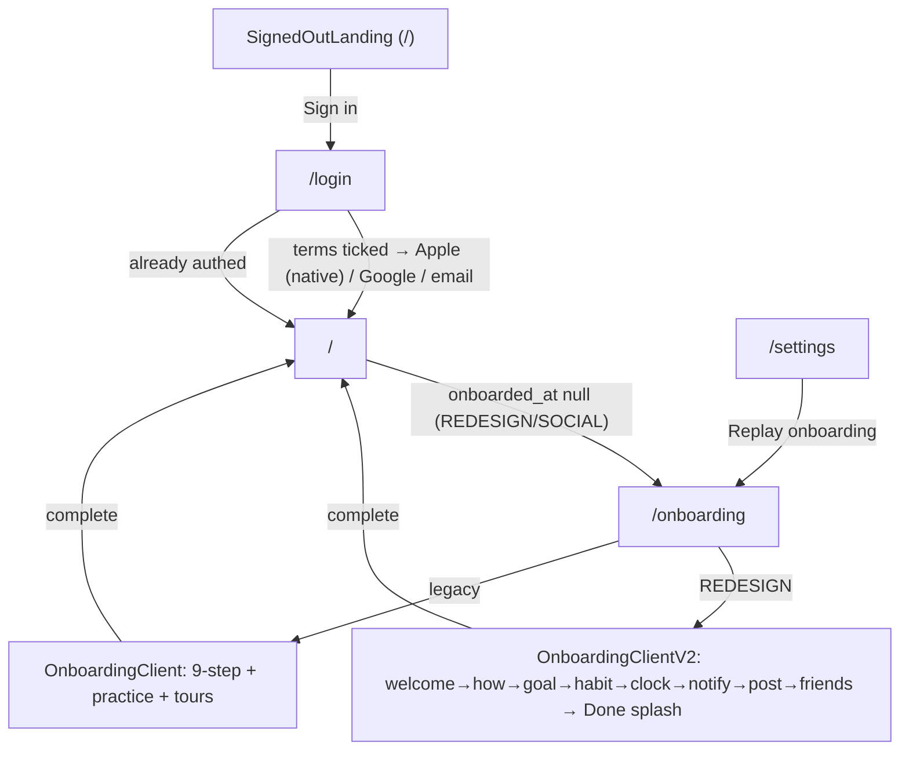
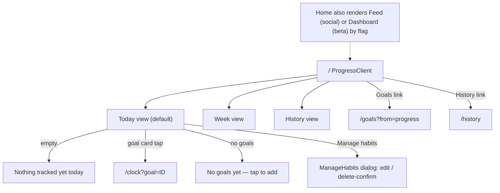
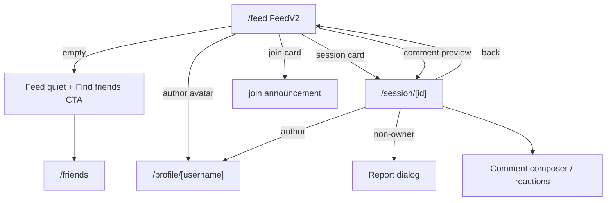
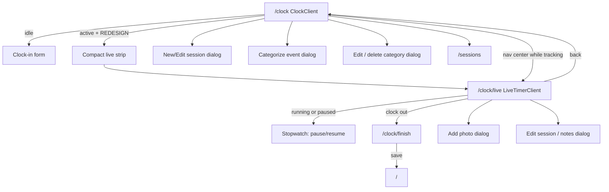
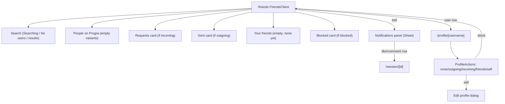
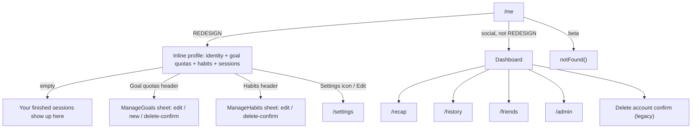
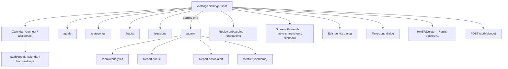

# Progra — Screen Inventory

Ground-truth enumeration of every screen, route-level state, overlay, and
whole-surface conditional state. Derived from the `app/` and `components/` trees;
every row cites `file:line`. Not derived from ARCHITECTURE.md.

## Flag context (governs which screens are reachable)
- `REDESIGN` (`lib/flags.ts:18`) is the master switch for the V2 information
  architecture. `SOCIAL_ENABLED` (`lib/flags.ts:26-27`) is `env || REDESIGN`, so
  **REDESIGN implies SOCIAL_ENABLED**.
- `CALENDAR_CONNECT` (`lib/flags.ts`) is **dark**: the Google Calendar connect
  affordance is hidden in Settings and History, the landing-page bullet is gone,
  and `/auth/google-calendar` redirects. Already-connected users keep sync and
  Disconnect.
- **The 250-seat beta cap gates every row in this document.** A signed-in user whose
  `profiles.seat_no` is null gets S53 instead of the route they asked for, on every
  path — it is a layout-level swap, not a route. Signed-out surfaces are unaffected.
- The bottom-nav has three layouts (`components/bottom-nav.tsx:41-63`): **V2
  (REDESIGN)** = Progress · Feed · [Clock] · Friends · You; **social** = Home ·
  You · [Clock] · Goals · Habits; **beta** = Home · Search · [Clock] · Goals ·
  Habits. This document treats the **V2 IA as primary** (the five tabs the task
  names); beta/social-only variants are called out where they differ.

---

## Flat screen table

Kinds: **route** (a `page.tsx`), **state** (route-level `loading`/`error`, or a
whole-surface conditional branch inside a client shell), **dialog** (Dialog /
Sheet / AlertDialog overlay).

### Routes

| Screen ID | Route | Kind | Entered from | Gate | File:line |
|---|---|---|---|---|---|
| R01 | `/` (Progress / home) | route | BottomNav "Progress"; post-login redirect | `getCurrentUser`; `!user`→SignedOutLanding; REDESIGN→`onboarded_at` redirect | app/page.tsx:19-56 |
| R02 | `/login` | route | any gated route when signed out | public; `getCurrentUser`→`redirect(next)` if authed. 2026-09-15 redesign: drifting brand mark, "Progra" typing itself in (`TypedHeadline`), tagline, `WeekPulse` bars, then `SignInButtons entrance` — everything rise-staggered, stilled under reduced motion (`data-login`) | app/login/page.tsx |
| R03 | `/onboarding` | route | `/` redirect when `onboarded_at` null; replay button | `requireUser`; REDESIGN→v2 wizard else legacy | app/onboarding/page.tsx |
| R04 | `/feed` | route | BottomNav "Feed"; `/session/[id]` back-link | `!REDESIGN`→`notFound`; `requireUser` | app/feed/page.tsx:9-12 |
| R05 | `/friends` | route | BottomNav "Friends"; feed/dashboard/profile links | `!SOCIAL_ENABLED`→`notFound`; `requireUser` | app/friends/page.tsx:18-20 |
| R06 | `/me` (You) | route | BottomNav "You" | `!SOCIAL_ENABLED`→`notFound`; `requireUser`; REDESIGN inline profile, else Dashboard. Since 2026-09-18 the "Goal quotas" and "Habits" headers open D28 / D21, same as Progress | app/me/page.tsx:41-49 |
| R07 | `/search` | route | beta nav "Search" only (no V2 inbound) | ungated placeholder (no auth/flag call) | app/search/page.tsx:4-23 |
| R08 | `/goals` | route | **ORPHANED 2026-09-18** — Settings "Your data" was its only link and is gone; URL-only now. Goals are managed by the `ManageGoals` sheet off the Progress "Goals" **or** You "Goal quotas" header, which has **no privacy toggle and no description field**, so those two are currently unreachable | ungated in page; RLS in loaders | app/goals/page.tsx:9-14 |
| R09 | `/habits` | route | **ORPHANED 2026-09-18** — URL-only. No loss: the `ManageHabits` sheet off the Progress **or** You "Habits" header is a strict superset (adds color-on-create and an editable back-week grid) | ungated in page; RLS in loaders | app/habits/page.tsx:10-22 |
| R10 | `/categories` | route | **ORPHANED 2026-09-18** — URL-only. `/clock`'s category tools cover name/color/delete but **not** `rules.titleContains` keywords, so keyword rules are uneditable in the UI (they still apply; `CALENDAR_CONNECT` is dark, so they only affect users who connected before) | `!REDESIGN`→`notFound`; `requireUser` | app/categories/page.tsx:12-14 |
| R11 | `/history` | route | **Progress "History" chip** (third pill in the Today/Week switcher — a `Link`, not a sub-tab; added 2026-09-17), and the Progress "Sessions" header on the Week tab → `?view=week&w=`. (`components/dashboard.tsx:119` also links here but Dashboard is the pre-REDESIGN home, so it's unreachable in the live config. Settings "Your data" does **not** link here — the older claim in this row was wrong.) | ungated in page; RLS in loaders. 2026-09-17: month/year scopes rebuilt from the `handoff-history/` design (Year/Month toggle + stepper, Time / Goal completion / Habit completion). `?view=week` unchanged — it's the Progress deep link and the way into `/recap` | app/history/page.tsx · history-client.tsx |
| R12 | `/sessions` | route | `clock-client.tsx:962` only (Settings row removed 2026-09-18). Read-only list; nothing was lost | ungated in page; RLS in loaders | app/sessions/page.tsx:7-15 |
| R13 | `/recap` | route | History scrubber; Dashboard | ungated in page; RLS in loaders | app/recap/page.tsx:14-19 |
| R24 | `/recap/[weekStart]` | route | Full-screen weekly recap **story** (5 panels: The number · Where it went · Goals · Your rank · Shareable card) | `requireUser`; `force-dynamic`; window via `weekWindow`; `getWeekLeaderboard` | app/recap/[weekStart]/page.tsx · recap-story.tsx (motion) |
| R25 | `/recap/[weekStart]/card` | route (OG) | 1080×1080 recap PNG (`next/og` ImageResponse) — shared as a File by the story's Share button | `getCurrentUser` (401 if none); `force-dynamic`; Node runtime | app/recap/[weekStart]/card/route.tsx |
| R14 | `/clock` | route | BottomNav center "Clock"; Progress goal cards; live-timer back | ungated in page; RLS in loaders | app/clock/page.tsx:10-17 |
| R15 | `/clock/finish` | route | live-timer clock-out redirect | `!REDESIGN`→`notFound`; `requireUser`; own-row + ended checks | app/clock/finish/page.tsx:25-46 |
| R16 | `/clock/live` | route | clock strip; nav center while tracking | `!REDESIGN`→`notFound`; `requireUser`; `!active`→`/clock` | app/clock/live/page.tsx:15-20 |
| R17 | `/session/[id]` | route | feed cards; You + profile session rows; notifications panel; like/comment/reply push taps (`#c-{commentId}` lands on the comment, expanding a collapsed thread) | `!REDESIGN`→`notFound`; `requireUser`; `!detail`→`notFound` (RLS) | app/session/[id]/page.tsx (loader) · session-view.tsx (screen) |
| R18 | `/profile/[username]` | route | author links in feed/friends/session/clocked-in/admin | `!SOCIAL_ENABLED`→`notFound`; `requireUser`; `!target`/blocked→`notFound` | app/profile/[username]/page.tsx:35-52 |
| R19 | `/settings` | route | `/me` settings icon | `!REDESIGN`→`notFound`; `requireUser` | app/settings/page.tsx:13-24 |
| R20 | `/admin` | route | Settings "Admin" (admins); Dashboard | `!SOCIAL_ENABLED`→`notFound`; `requireAdmin` (signed-out→`/login`, not admin→`notFound`) | app/admin/page.tsx |
| R26 | `/admin/analytics` | route | "Analytics" row at the top of /admin | `requireAdmin` only — **not** `SOCIAL_ENABLED`-gated; `?sort=active\|opened\|joined` | app/admin/analytics/page.tsx |
| R27 | `/clock?goal=<id>` | deep link | where a goal nudge's push and its panel row land — the clock picker with that goal preselected (an unknown id is ignored) | existing `/clock` searchParam | app/clock/page.tsx |
| R21 | `/privacy` | route | footer links (`/`, `/terms`, login) | public | app/privacy/page.tsx:8 |
| R22 | `/terms` | route | footer links (`/`, `/privacy`) | public | app/terms/page.tsx:8 |
| R24 | `/support` | route | landing footer; /privacy and /terms footers; App Store Connect Support URL | public (no auth helpers) | app/support/page.tsx:15 |
| R23 | `/i/[username]` | route | invite links already in the wild — a **new** share hands out the App Store listing instead (2026-09-17) | `!SOCIAL_ENABLED`→`notFound`; else **public** (`getOptionalUser`) | app/i/[username]/page.tsx:17-29 |
| R28 | `/refer` | route | nothing links it — `ReferFriendButton` is imported nowhere, so URL-only | `!REFER_ENABLED`→`notFound`; else `requireUser` | app/refer/page.tsx |

R23 states: signed-out + valid handle → invite landing (avatar/name/bio + Continue with Google, carries `?ref=`, then a secondary **Get Progra on the App Store** button — sign-in stays first because it is the only path that attributes); signed-in **other** user → `claim_invite` then `redirect(/profile/{username})`; signed-in **self** → `redirect(/me)`; unknown handle → inline "Invite not found" card (not `notFound()`) + an "Or get Progra on the App Store" text link. `AddToHomeHint` was removed from both branches on 2026-09-17 (it targets exactly the audience the native app now serves). Loader: `app/i/[username]/loading.tsx` (`PrograLoader`).

### Route-level states (loading)

No `error.tsx` or `not-found.tsx` boundaries exist anywhere in `app/` — `notFound()`
falls through to the Next.js default.

| Screen ID | Route | Kind | Renders | File:line |
|---|---|---|---|---|
| L01 | `/` (root) | state | `<PrograLoader />` branded clock loader | app/loading.tsx:6 |
| L02 | `/clock` | state | `<PageSkeleton title="Clock" blocks={3} />` | app/clock/loading.tsx:4-10 |
| L03 | `/habits` | state | `<PageSkeleton title="Habits" />` | app/habits/loading.tsx:4-10 |
| L04 | `/feed` | state | `<PageSkeleton title="Feed" />` | app/feed/loading.tsx:4-10 |
| L05 | `/goals` | state | `<PageSkeleton title="Goals" />` | app/goals/loading.tsx:4-10 |
| L06 | `/recap` | state | `<PageSkeleton title="Recap" />` | app/recap/loading.tsx:4-10 |
| L07 | `/me` | state | `<PageSkeleton title="You" />` | app/me/loading.tsx:4-10 |
| L08 | `/friends` | state | `<PageSkeleton title="Friends" />` | app/friends/loading.tsx:4-10 |
| L09 | `/history` | state | `<PageSkeleton title="History" />` | app/history/loading.tsx:4-10 |
| L10 | `/sessions` | state | `<PageSkeleton title="Session history" />` | app/sessions/loading.tsx:4-10 |
| L11 | `/categories` | state | `<PageSkeleton title="Categories" />` | app/categories/loading.tsx:4-10 |
| L12 | `/admin/analytics` | state | `<PageSkeleton title="Analytics" />` | app/admin/analytics/loading.tsx |

### Dialogs / sheets / overlays

| Screen ID | Overlay | Kind | Mounted by | Reachable from | File:line (overlay) |
|---|---|---|---|---|---|
| D01 | New/Edit category | dialog | categories-client | /categories | app/categories/categories-client.tsx:164 |
| D02 | Delete category confirm | alert | categories-client | /categories | app/categories/categories-client.tsx:238 |
| D03 | Edit goal | dialog | goals-client | /goals | app/goals/goals-client.tsx:384 |
| D04 | Archive goal confirm | dialog | goals-client | /goals | app/goals/goals-client.tsx:440 |
| D05 | Edit habit | dialog | habits-client | /habits | app/habits/habits-client.tsx:264 |
| D06 | ~~Delete session / remove event confirm~~ | — | — | — | **Gone.** The per-item delete was dropped from History before 2026-09-17 (see the note in the pre-rebuild `RollupBody`); this row was stale. Session deletion lives on `/sessions`. |
| D07 | Edit profile (identity) | sheet | settings-client | /settings (identity block) | app/settings/settings-client.tsx (BottomSheet) |
| D08 | Time-zone picker | sheet | settings-client | /settings → Time zone row | app/settings/settings-client.tsx (BottomSheet; search + list, current zone pinned first) |
| D09 | Edit profile | dialog | profile-actions | /profile/[username] (self) | app/profile/[username]/profile-actions.tsx:148 |
| D10 | Edit category | dialog | clock-client | /clock | app/clock/clock-client.tsx:1026 |
| D11 | Delete category confirm | dialog | clock-client | /clock | app/clock/clock-client.tsx:1079 |
| D12 | Edit session | dialog | live-timer-client | /clock/live | app/clock/live/live-timer-client.tsx:415 |
| D13 | Session notes | dialog | live-timer-client | /clock/live | app/clock/live/live-timer-client.tsx:527 |
| D14 | Report action | alert | admin-reports | /admin | app/admin/admin-reports.tsx:268 |
| D15 | New/Edit session log | dialog | SessionDialog (dynamic) | /clock | components/session-dialog.tsx:73 (mount clock-client.tsx:1104) |
| D16 | Delete session confirm (nested) | alert | SessionDialog | /clock | components/session-dialog.tsx:389 |
| D17 | Categorize event | dialog | EventCategoryDialog (dynamic) | /clock | components/event-category-dialog.tsx:41 (mount clock-client.tsx:1117) |
| D18 | Add a photo | dialog | SessionPhotoStep (dynamic) | /clock, /clock/live | components/session-photo-step.tsx:82 (mounts clock-client.tsx:1126, live-timer-client.tsx:555) |
| D19 | ~~Categorization review~~ | — | — | — | **Gone 2026-09-17.** The AI auto-categorize feature was deleted with the calendar affordances on /history; the dialog, its button and the server action no longer exist. |
| D20 | Frame your photo (crop) | dialog | AvatarCropDialog (dynamic) | /settings, /onboarding | components/avatar-crop-dialog.tsx:41 (mount avatar-picker.tsx:140) |
| D21 | Manage habits | dialog | ManageHabits (dynamic) | `/` (Progress), `/me` (You) | components/v2/manage-habits.tsx:199 (mounts progress-client.tsx:117, me/habits-section.tsx:58) |
| D22 | Delete habit confirm (nested) | alert | ManageHabits | `/` (Progress), `/me` (You) | components/v2/manage-habits.tsx:349 |
| D23 | Edit habit (nested) | dialog | ManageHabits | `/` (Progress), `/me` (You) | components/v2/manage-habits.tsx:421 |
| D24 | Report content | dialog | ReportButton | /profile/[username], /session/[id], feed cards | components/report-button.tsx:79 |
| D25 | Delete account confirm | alert | DeleteAccountButton | Dashboard only (beta/social `/`, `/me`) — legacy | components/delete-account-button.tsx:49 (mount dashboard.tsx:233) |
| D26 | Notifications panel | sheet | NotificationsBell | /friends | components/notifications-bell.tsx:69 (mount friends-client.tsx:163) |
| D27 | Report a bug | sheet | Settings → Help → "Report a bug" | /settings | components/v2/report-bug-sheet.tsx:16 (lazy via next/dynamic, mount settings-client.tsx:332) |
| D28 | Manage goals | sheet | ManageGoals (dynamic) | `/` (Progress), `/me` (You) | components/v2/manage-goals.tsx:106 (mounts progress-client.tsx:461, me/goals-section.tsx:48) |
| D29 | Edit/new goal (nested) | sheet | ManageGoals | `/` (Progress), `/me` (You) | components/v2/manage-goals.tsx:177 |
| D30 | Delete goal confirm (nested) | alert | ManageGoals | `/` (Progress), `/me` (You) | components/v2/manage-goals.tsx:250 |
| D31 | Session finished (unattended) | modal | root layout, when a timed session hit its target with nobody watching | anywhere | components/v2/plan-complete-modal.tsx:19 (mount app/layout.tsx). Both buttons stamp `sessions.plan_reviewed_at`; a dismiss that didn't write would reopen it every load. *(Row added 2026-09-18 — it had never been listed.)* |
| D32 | What's new | modal | root layout, once per release | `/` only | components/v2/whats-new-modal.tsx (mount app/layout.tsx). Content is `lib/patch-notes.ts`, newest entry only. Gated on `user && onboarded_at != null && !planComplete && patchNote` — D31 outranks it, and suppression never stamps, so the note just waits. Every close path stamps `profiles.patch_notes_seen_version`. Route **allowlist** (`pathname !== "/"` → null), not a denylist |

### Whole-surface conditional states

Grouped by surface. Only branches that swap the whole surface or a major section.

| Screen ID | Surface | State kind | What it shows | Trigger | File:line |
|---|---|---|---|---|---|
| S01 | clock-client | status | active-session surface vs. clock-in form | `activeSession` truthy | app/clock/clock-client.tsx:500 |
| S02 | clock-client | status | active: compact live strip (REDESIGN) vs. full "Clocked in" card | `REDESIGN ?` | app/clock/clock-client.tsx:501 |
| S03 | clock-client | status | paused vs. running (badge, Resume/Pause) | `isPaused(activeSession)` | app/clock/clock-client.tsx:515,645 |
| S04 | clock-client | mode | day-mode vs. week-mode header/body | `inDayMode` | app/clock/clock-client.tsx:840,864 |
| S05 | clock-client | empty | "No sessions logged" (day) | `day.rows.length === 0` | app/clock/clock-client.tsx:870 |
| S06 | clock-client | empty | "No sessions logged yet this week." | `categoryBreakdown.length === 0` | app/clock/clock-client.tsx:964 |
| S07 | finish-client | pending | "Saving…" vs "Save session" | `pending` | app/clock/finish/finish-client.tsx:121 |
| S08 | finish-client | other | photo section only when photo exists | `photoUrl &&` | app/clock/finish/finish-client.tsx:82 |
| S09 | live-timer-client | status | "Paused" vs "Tracking" (timer color, Resume/Pause, glow) | `paused = pausedSince != null` | app/clock/live/live-timer-client.tsx:282-288,401 |
| S10 | live-timer-client | other | "Photo attached" chip vs "Add photo" | `hasPhoto ?` | app/clock/live/live-timer-client.tsx:375 |
| S11 | live-timer-client | edit sub-state | edit sheet: "Ended at" + "Finish session" vs "Save" | `!stillRunning &&` | app/clock/live/live-timer-client.tsx:504,520 |
| S12 | onboarding-client-v2 (REDESIGN) | step | 8-step machine (7 on web): welcome→how→goal→habit→clock→*notify*→post→friends, then the Done splash. `notify` is native-only; `clock`, `post` and the friends-step nudge are deliberate practice (write nothing); the goal and habits are created for real. Header: back (hidden on welcome), 8 dots, Skip (→ `completeOnboarding` + home). Footer: `PrimaryButton size="screen"` (40% + `aria-disabled` when gated) + a quiet skip on habit/notify/friends | `stepIndex` (number) in the shell; steps are props-down components in app/onboarding/steps/ | app/onboarding/onboarding-client-v2.tsx |
| S13 | onboarding step headline | other | every headline types in letter-by-letter behind a navy caret (`TypedHeadline`, 280ms then 32ms/char); an invisible ghost keeps the height stable; retypes on every step entry incl. Back; full text + no caret under reduced motion | `key={step}` remount | components/v2/typed-headline.tsx · app/onboarding/onboarding-ui.tsx (`StepTemplate`) |
| S14 | onboarding `friends` step | state | Nudge pill (left of the gear, as on a real profile) → "Pick a message" list from `NUDGE_PRESETS` → navy bubble + "Nudge sent to Maya", pill dims to "Nudged". CTA "Share with friends" → `shareInvite` (share sheet / clipboard) → CTA becomes "Start my week"; quiet skip "Start my week without sharing" | `nudgeOpen`, `nudged`, `shared` | app/onboarding/steps/friends-step.tsx |
| S15 | onboarding Done splash | overlay | "Ready. / Set. / GO!" (rise 0/.45/.95s), `WeekPulse`, summary line; `completeOnboarding` runs alongside a 3.2s hold, then `router.push("/")`; an error toasts and drops back to the step | `done` | app/onboarding/done-splash.tsx |
| S16 | onboarding-client (legacy, !REDESIGN) | step | 9-step machine incl. tour-home/history/habits early-returns | `useState<Step>("welcome")` | app/onboarding/onboarding-client.tsx:151; :262,280,292,315,330,367,392,442,531 |
| S17 | onboarding-client (legacy) | sub-machine | practice: idle / running / done | `practicePhase` | app/onboarding/onboarding-client.tsx:168,461,485,516 |
| S18 | onboarding-client (legacy) | sub-machine | tour spotlights (home recap/history). The `tour-history` step and its `historyTour` sub-machine went with the auto-categorize deletion (2026-09-17) — they taught Sync and Auto-categorize, both now gone. Legacy/pre-REDESIGN only. | `homeTour` | app/onboarding/onboarding-client.tsx (TourHome) |
| S19 | friends-client | search | "Searching…" / "No users found." / results, when query≥2 | `searching`; `results.length===0` | app/friends/friends-client.tsx:181-193 |
| S20 | friends-client | empty | people-on-Progra empty ("added everyone 🎉" vs "No one else") | `people.length === 0` | app/friends/friends-client.tsx:209-211 |
| S21 | friends-client | empty | "No friends yet — search above…" | `friends.length === 0` | app/friends/friends-client.tsx:296 |
| S22 | friends-client | section toggles | Requests / Sent / Blocked cards only when non-empty | `incoming/outgoing/blocked.length>0` | app/friends/friends-client.tsx:228,268,328 |
| S23 | friends-client | relationship (per-row) | action: Friends / Requested / Accept / Add | `renderAction` branches | app/friends/friends-client.tsx:116,123,131,142 |
| S24 | goals-client | empty | "No active goals yet. Add one below." | `goals.length === 0` | app/goals/goals-client.tsx:202 |
| S25 | goals-client | empty | per-goal "No sessions yet…" | `goalSessions.length === 0` | app/goals/goals-client.tsx:283 |
| S26 | habits-client | empty | "No habits yet. Add one below." | `optimisticItems.length === 0` | app/habits/habits-client.tsx:159 |
| S27 | categories-client | empty | "No categories yet…" vs. list | `categories.length === 0` | app/categories/categories-client.tsx:115 |
| S28 | categories-client | mode | dialog "Edit category" vs "New category" | `editing.mode` | app/categories/categories-client.tsx:167,237 |
| S29 | history-client | view | week summary (original chrome + shared `WeekSummary`) vs. the 2026-09-17 month/year design | `props.view === "week"` | app/history/history-client.tsx:139 |
| S30 | history-client | nav | week scrubber "Next" vs. current-period label; month/year stepper's › greys out | `isCurrentPeriod \|\| isFuturePeriod` | app/history/history-client.tsx:152,229 |
| S31 | history-client | empty | "Nothing logged in {label}." | `rollup.categoryRows.length === 0` | app/history/history-client.tsx:467 |
| S54 | history-client | scope | Year vs. Month pill toggle — URL-driven (`?view=`), server re-render, no client fetch | `props.view` | app/history/history-client.tsx:198-232 |
| S55 | history-client | view | habit completion: per-habit rate rows (Year) vs. per-day navy calendar (Month) | `monthName != null` | app/history/history-client.tsx (HabitCompletionSection) |
| S56 | history-client | empty | Goal- and Habit-completion sections omitted entirely | `perGoal.length === 0` / `perHabit.length === 0` | app/history/history-client.tsx (GoalCompletionSection, HabitCompletionSection) |
| S57 | history-client | expand | a Time row opens its audit list (the sessions/events behind it) — read-only; carried over from the donut this section replaced | `openKey === key`, rows with `categoryItems` only | app/history/history-client.tsx (TimeSection, AuditList) |
| S32 | sessions-client | empty | "No past sessions[ in this category] yet." | `groups.length === 0` | app/sessions/sessions-client.tsx:158 |
| S33 | sessions-client | paging | "Load older" / "Loading…" | `hasMore`; `loading` | app/sessions/sessions-client.tsx:258,265 |
| S34 | recap-client | nav | scrubber "Next" vs "This week" (RecapCard always renders) | `isCurrentWeek || isFutureWeek` | app/recap/recap-client.tsx:110 |
| S35 | settings-client | connection | calendar "Disconnect" vs "Connect" (+ unverified warning) vs. **absent entirely** while `CALENDAR_CONNECT` is dark and the user isn't already connected | `calendarConnected ?`; `CALENDAR_CONNECT`; `SHOW_UNVERIFIED_WARNING` | app/settings/settings-client.tsx:239,250,267 |
| S36 | settings-client | role | "Admin" section + row (→ /admin, badge = open reports + open bugs) only for admins | `isAdmin &&` | app/settings/settings-client.tsx |
| S37 | progress-client (home) | tabs | Today / Week views. The third "History" pill beside them is a `Link` to `/history`, **not** a third tab — it never renders active here and `Tab` stays `"today" \| "week"`. `/history` renders the same rail with History lit and Today/Week as links back (`/` and `/?tab=week`), so the three read as one switcher across the route boundary; the chip classes live in `components/v2/period-chips.tsx` so they can't drift | `useState<Tab>("today")` | components/v2/progress-client.tsx (Tab, switcher) |
| S58 | history-client | nav | `PeriodRail` — the Today/Week/History rail with History active, on **both** the week and month/year scopes. Replaced the "← Back to progress" link 2026-09-17; the page's top padding was matched to Progress's `pt-7` so the rail doesn't shift on the jump | always | app/history/history-client.tsx (PeriodRail) |
| S50 | progress-client (home) | nudge | "Your week is ready" recap banner (above the tabs) → opens `/recap/{weekStart}` | `props.recapNudge` (set in `loadProgressData` when the week unlocked Sun 6pm local & is unopened) | components/v2/recap-nudge.tsx · components/v2/progress-client.tsx |
| S38 | progress-client | empty | "Nothing tracked yet today." | `sessionsToday.length === 0` | components/v2/progress-client.tsx:209 |
| S39 | progress-client | empty | "No goals yet — tap to add one." | `goals.length === 0` | components/v2/progress-client.tsx:259 |
| S40 | progress-client | empty | "No habits yet — tap to add one." | `optimisticHabits.length === 0` | components/v2/progress-client.tsx:326 |
| S41 | feed-v2 (server) | empty | "Your feed's quiet…" + **InviteShare** (share/copy the App Store invite) + "find people already on Progra" link | `entries.length===0 && clockedIn.length===0` | components/v2/feed-v2.tsx |
| S42 | feed-v2 | entry kind | join-announcement card vs. session card | `entry.kind === "join"` | components/v2/feed-v2.tsx:95 |
| S51 | feed-v2 | entry kind | **recap post** card ("{name} uploaded their weekly recap!" + navy summary) | `entry.kind === "recap"` | components/v2/recap-feed-card.tsx · feed-v2.tsx |
| S52 | recap-story (final panel) | post | caption box + "Post to feed" → `postRecap`; button flips to "Posted ✓" | `posted` state | app/recap/[weekStart]/recap-story.tsx (ShareableCardPanel) |
| S43 | feed-v2 | other | comment preview vs. "Add a comment" | `preview ?` | components/v2/feed-v2.tsx:258 |
| S44 | /me (You, server) | empty | "Your finished sessions show up here." | `pastSessions.length === 0` | app/me/page.tsx:195 |
| S45 | /me (You) | role | REDESIGN inline profile vs. Dashboard vs. 404 | `SOCIAL_ENABLED`, `REDESIGN` | app/me/page.tsx:42,45 |
| S68 | /me (You) | empty | "No goals yet — tap to add one." (opens D28) | `goals.length === 0` | app/me/goals-section.tsx:35 |
| S46 | profile/[username] (server) | relationship | notFound: flag off / no user / blocked | `!SOCIAL_ENABLED`,`!target`,`blocked` | app/profile/[username]/page.tsx:40,45,52 |
| S47 | profile/[username] | relationship | full content vs. "Add @X as a friend…" private card | `canSeeContent` (self/friends) | app/profile/[username]/page.tsx:78,83 |
| S48 | profile/[username] | empty | "No shared sessions yet." | `pastSessions.length === 0` | app/profile/[username]/page.tsx:180 |
| S49 | profile-actions | relationship | none→Add / outgoing→Cancel / incoming→Accept+Decline / friends→Remove+Block / self→Edit | `relationship.kind` | app/profile/[username]/profile-actions.tsx:59,63,74,84,106,132 |
| S53 | RootLayout (every route) | capacity | **beta-full wall** in place of the entire app tree — no children, no BottomNav, no session/push leaves — vs. the normal app shell | `isWaitlisted(profile)` AND `claim_beta_seat_self()` returns null | app/layout.tsx:99-132, components/beta-full.tsx:7 |
| S57 | ~~research-interview opt-in~~ | — | **Gone entirely 2026-09-19.** The onboarding ask went 2026-09-15, leaving the Settings toggle as the only surface; that toggle was the *withdrawal* path the privacy policy promised, so removing it alone would have stranded everyone already opted in. Removed together with a clear of the stored consents and a rewrite of the privacy policy's Research paragraph. `profiles.interview_consent`/`_at`, `setInterviewConsent` (no caller) and the /admin panel are all kept | — | — |
| S58 | /admin/analytics | dashboard | Retention stats (active 7d / 30d, never came back, each with n/m) · 30-day DAU bars · cohort table (blank = window not elapsed) · roster cards with Opened / Did something, 30-day sparkline, goals ("+N private"), tags (excluded · waitlisted · not onboarded · opening, not doing); "analytics RPCs aren't installed" line when either RPC errors | `admin_list_users()` / `admin_activity_days()` | app/admin/analytics/page.tsx, user-card.tsx, cohort-table.tsx, charts.tsx |
| S59 | profile/[username] (Nudge chip) | role | Nudge chip beside the gear for a **friend** only. `ok` → chip opens S60. `cooldown` → dimmed "Nudged · 4h"; `locked` → dimmed 🔒 "Nudge". A tap on either toasts the reason (turned off · before 9am their time + wait · in a session · all caught up · nothing to nudge · can't right now). `hidden` (not a friend) renders nothing. Private sessions are ignored, never a reason | `getNudgeState()` · `nudgeRefusalMessage` | app/profile/[username]/nudge-button.tsx |
| S60 | Nudge sheet | step | Step 1 targets (one row per behind-today visible goal, `Goal · {title}` + color marker; `Habits` row "{n} of {m} left today") → step 2 the five presets; a preset tap sends | local `target` state | app/profile/[username]/nudge-sheet.tsx |
| S61 | notifications-bell (nudge row) | entry kind | "**{name}** nudged you" + preset copy + `Goal · {label}`/`Habits` · time; never collapsed; links to `/clock?goal=` or `/`; Report flag sibling opens the report dialog | `item.kind === "nudge"` | components/notifications-bell.tsx |
| S63 | session-view (comment threads) | role | `COMMENT_REPLIES` on: comments render as threads one level deep — replies indented to the text column (20px avatar, no divider), "@name" before a reply to a reply; each row's meta line gets a **Reply** button. Off: the flat list, unchanged. Header count includes replies | `COMMENT_REPLIES` | components/v2/comment-threads.tsx · comment-row.tsx |
| S64 | comment thread (collapse) | state | 4+ replies show the first 2 + "View N more replies"; expanded → "Hide replies". A `#c-{id}` deep link opens its thread and tints the row | `openThreads` / hash | components/v2/comment-threads.tsx |
| S65 | comment thread (inline reply box) | step | "Replying to {name} · Cancel" + 16px input "Reply to {name}…" + Post, under the thread being answered; one open at a time; Esc/Cancel returns focus to that Reply button; the bottom composer stays for top-level comments | `replyTo` | components/v2/comment-threads.tsx |
| S66 | delete-thread dialog | dialog | "Delete comment? This also deletes its N replies." — only for a top-level comment with replies | `replyCount > 0` | components/v2/delete-thread-dialog.tsx |
| S67 | notifications-bell (reply row) | entry kind | "**{name}** replied to you" + body + label · time; links to `/session/{id}#c-{commentId}`. A reply on my post to my comment shows only here, not also as "commented"; blocked authors never show | `item.kind === "reply"` | components/notifications-bell.tsx |
| S62 | settings-client (Nudges) | toggle | "Nudges" row in **Sharing** (gated on `NUDGES`, not push permission) — whether friends may nudge you at all. The push row above it becomes "Likes, comments & nudges" | `nudges_enabled` | app/settings/settings-client.tsx |
| S54 | /admin (Beta capacity) | capacity | seated-of-cap + waiting counts, editable seat cap, one Grant-a-seat card per waitlisted user; "RPCs aren't installed" line when the overview RPC errors | `admin_beta_overview()` / `admin_list_waitlist()` | app/admin/admin-waitlist.tsx:28, app/admin/page.tsx |
| S55 | /admin (Bug reports) | queue | open-first list of user bug reports with device/route/build context; Resolve · Dismiss · Reopen; "RPCs aren't installed" line vs. "Nothing reported yet" | `admin_list_bug_reports()` | app/admin/admin-bug-reports.tsx:29, app/admin/page.tsx |
| S56 | /admin (Interview consents) | list | opted-in users with email, name and consent date, plus a CSV download; "Nobody has opted in yet" vs. "RPCs aren't installed" | `admin_list_interview_consents()` | app/admin/admin-interviews.tsx:36, app/admin/page.tsx. **Since 2026-09-19 this always shows the empty state** — consents were cleared and nothing can set one (see S57); kept so restarting interviews needs no migration |

---

## Flowcharts (per bottom-nav tab, plus auth/onboarding and settings/admin)

### Auth + Onboarding

### Progress tab (`/`)

### Feed tab (`/feed`)

### Clock tab (`/clock`)

### Friends tab (`/friends`)

### You tab (`/me`)

### Settings + Admin

---

## Unreachable or orphaned

**Routes with no inbound link under the V2 (REDESIGN) IA:**
- **`/search`** (R07) — not a tab in the V2 nav (only the **beta** nav references
  `/search`, `components/bottom-nav.tsx:59`) and nothing links to it. It is an
  ungated placeholder (`app/search/page.tsx:4-23`). Reachable only by typing the
  URL while REDESIGN is on.

**Reachable only when flags are OFF (dark/legacy under REDESIGN):**
- **`Dashboard`** and therefore **`DeleteAccountButton` (D25)** render only on the
  `!REDESIGN` path (`app/me/page.tsx:40-43`, home `app/page.tsx:55`,
  `components/dashboard.tsx:233`). Under REDESIGN, account deletion is instead the
  `HoldToDelete` control in Settings (`app/settings/settings-client.tsx:304` →
  `/login?deleted=1`, `components/v2/hold-to-delete.tsx:41`).
- **`OnboardingClient` (legacy, S16-S18)** and its practice/tour sub-screens render
  only when `!REDESIGN` (`app/onboarding/page.tsx:46-108`). Under REDESIGN the v2
  wizard (S12) is used instead.
- **Beta/social nav tabs** `/goals` and `/habits` as *top-level tabs*
  (`bottom-nav.tsx:54-62`) — under REDESIGN these are reached via Settings, not the
  nav.

**Dialog components imported nowhere:** none. Every Dialog/Sheet/AlertDialog
consumer in `components/` has a confirmed mount site (D01-D26).

**Listed-but-not-overlays (no Dialog/Sheet/AlertDialog rendered):**
- `components/delete-comment-button.tsx` — one-tap delete (no confirm) for a
  comment without replies; mounts in `components/v2/comment-row.tsx` and
  `components/feed.tsx`. A top-level comment WITH replies opens
  `components/v2/delete-thread-dialog.tsx` (AlertDialog) first.
- `components/v2/hold-to-delete.tsx` — press-and-hold control; mounts at
  `app/settings/settings-client.tsx:304`.

**No `<Drawer>` usage** anywhere; the only `<Sheet>` consumer is the Notifications
panel (D26).

**No custom `error.tsx` / `not-found.tsx`** boundaries exist in `app/` — every
`notFound()` renders the framework default.
